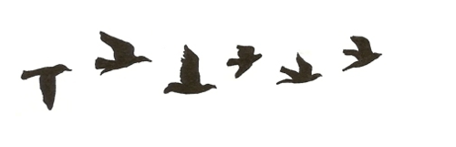

# Herencia de Aves

En este ejercicio el comportamiento general de las aves es el siguiente:

* **volar(kilometros)**: esto les insume 10 joules + la cantidad de kilómetros que volaron
* **comer(gramos)**: esto implica recuperar 4 joules por cada gramo que comen.

Además, tenemos tres tipos de ave:

* la **golondrina tijerita** como pepita se comporta como toda ave
* el **petrel** que vuela y come como cualquier ave pero tiene un *TOC* que le hace contar la cantidad de kilómetros que vuela
* la **torcaza** que vuela y come como cualquier ave pero al comer se atolondra tanto que vuela 1 kilómetro para celebrar (eso obviamente le hace perder energía)

Tenés una batería de **tests** que aplican sobre 

* el vuelo de las aves
* el vuelo del petrel
* la forma de comer de la torcaza

# Conceptos vistos en el ejemplo

* Herencia
 * Redefinición
 * Uso de super y self.
* Polimorfismo. ¿Qué elementos son polimórficos? ¿Cómo te das cuenta?

